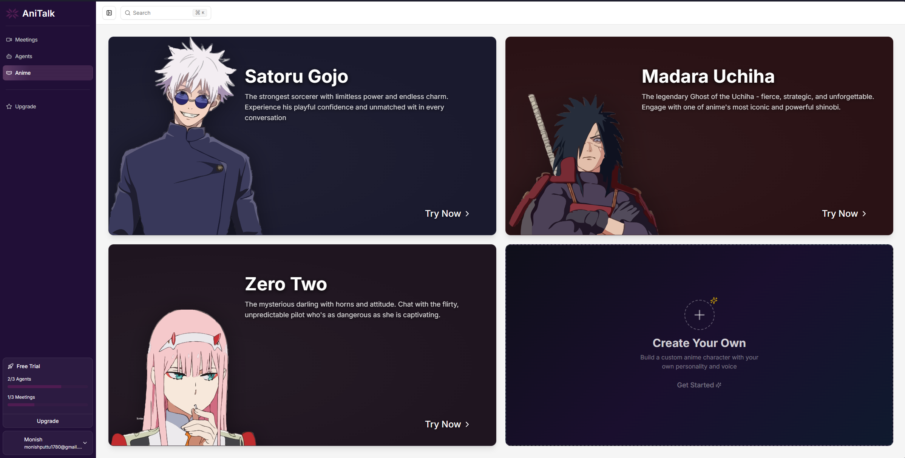
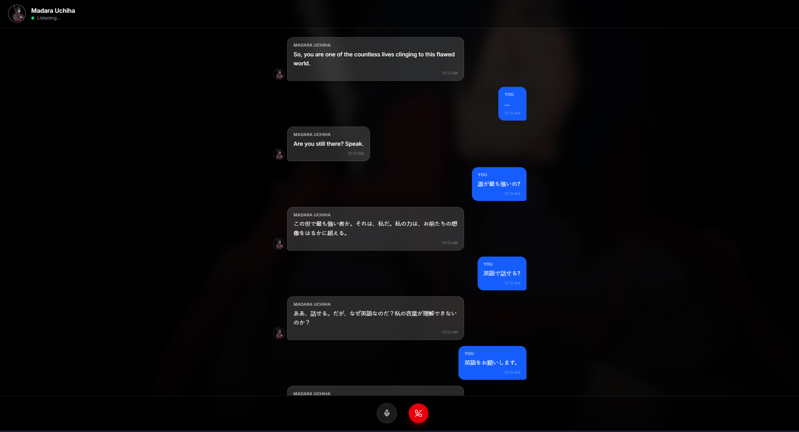
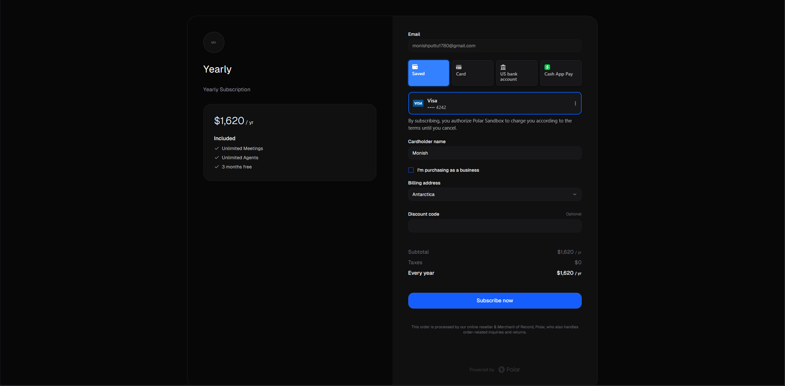

# AniTalk

**AniTalk** is a **voice-based agentic platform** that allows users to interact with custom AI agents through natural voice conversations.  
It also features a unique mode where users can talk to their **favourite anime characters** via immersive voice chat.

---

## 🚀 Features

### 🎙️ Core Capabilities

- **Voice-First Conversations**  
  Talk naturally with AI agents using real-time speech-to-text and text-to-speech.

- **Custom AI Agents**  
  Create agents for different purposes like productivity, learning, entertainment, or companionship.

- **Anime Character Interaction**  
  Chat with AI personalities inspired by popular anime characters in voice mode.

- **Context-Aware Dialogue**  
  Agents remember conversation context to provide coherent, flowing interactions.

- **Configurable Personalities**  
  Control tone, behavior, and response style of each agent.

---

## 🖼️ Screenshots

### Anime Character Selection

### Voice Chat Interface

### Custom AI Chat Window

### Payment Integration

---

## 💡 Why AniTalk?

AniTalk combines **voice AI**, **agentic systems**, and **character-driven interaction** to deliver:

- A hands-free, natural conversational experience
- Flexible agent creation for real-world use cases
- A fun, immersive way to talk to anime characters
- A scalable foundation for future voice-AI applications

---

### 🗣️ How It Works

AniTalk is powered by:

- Speech-to-Text → converts voice input to text

- LLM Engine → processes context & agent behavior

- Text-to-Speech → generates natural voice responses

- Agent Personas → define identity, style, and behavior

- Conversation Memory → maintains dialogue context

### 🌟 Use Cases

- 🎓 Voice tutors & learning companions

- 🧑‍💻 Productivity & planning assistants

- 🎭 Anime character role-play chats

- 🤖 Conversational AI experiments

- 💬 Hands-free AI companions

- 🧩 Creating Custom Agents

🐛 Report issues

💡 Suggest feature
